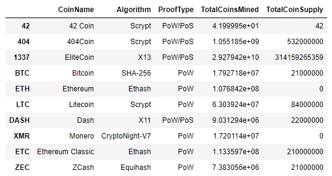
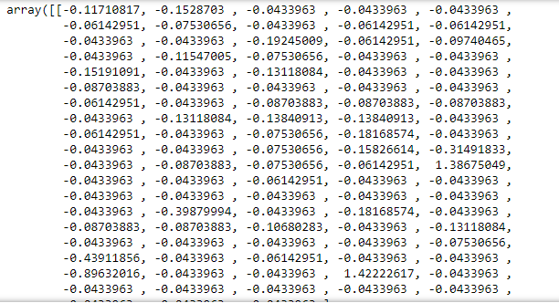
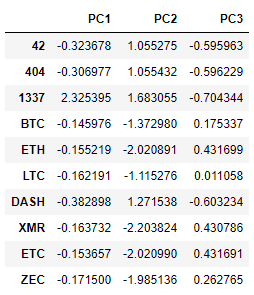
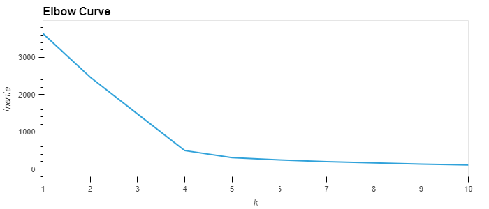
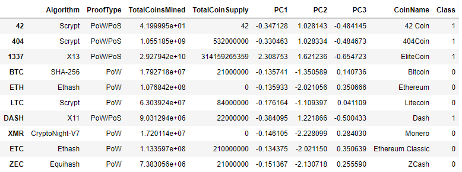
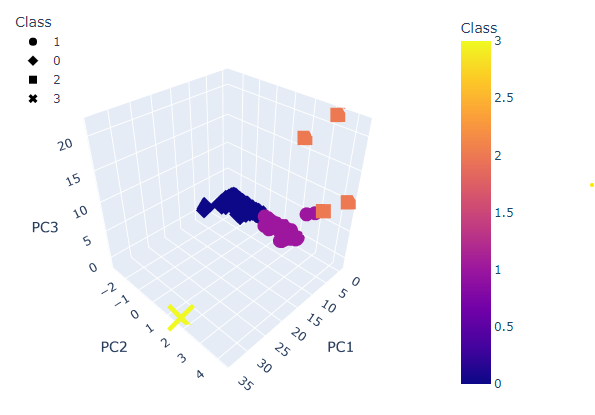
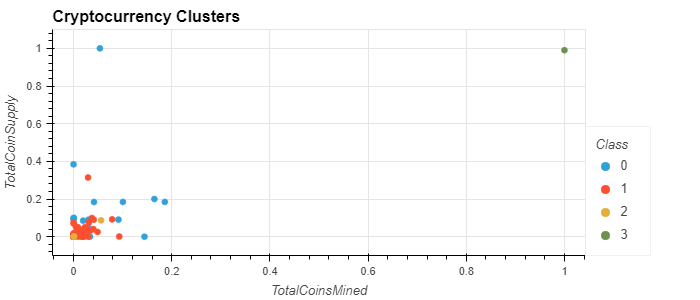
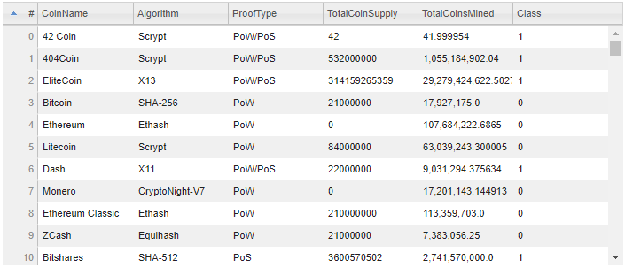

# Cryptocurrencies

## Overview:
Using Unsupervised Machine Learning Algorithms to classify various cryptocurrencies into investment portfolios.

## Using Unsupervised Machine Learning
### Step 1: Preprocessing the Data
In this step we use Pandas to drop null values, filter for cryptocurrencies that are actually traded, have a working algorithm, and have actually mined coins. We then drop the unnecessary columns (after the filtering step) and separate the DataFrame into X (features dataframe) and y (Cryptocurrency names).

In order to prepare the data for our Machine Learning algorithms, we use the pandas `get_dummies()` method to encode our text features and store them in a DataFrame. We then used the sklearn library's `StandardScalar()` and `fit_transform()` functions to standardize these features.

### Step 2: Principal Component Analysis (PCA)
In this step, we use Principal Component Analysis (PCA) from the sklearn library to reduce the dimensions of our DataFrame down to three principal components. The Principal Components are stored in a new DataFrame in separate columns (PC1, PC2, PC3).

### Step 3: Clustering with K-Means Algorithm and Elbow Curve
We begin this step by creating an elbow curve to find the "best" value for 'K' (number of clusters to split our data into). Upon plotting elbow curve (using hvplot) we can see the sharpest 'elbow' at k = 4. Therefore, we will set `n_clusters = 4` in our K-Means algorithm. 

Once we initialize our K-Means algorithm with `n_clusters = 4`, we use `model.predict` and pass our 3 principal components through our model, to come up with predictions for each Cryptocurrency. We bring this all together into a final summarized DataFrame showing a prediction ('Class') for each Cryptocurrency (grouping each currency into 1 of 3 'clusters' or categories).

### Step 4: Visualization
Using `scatter_3d` from the plotly.express library, we can visualize our 4 data clusters in three dimensions.

The hvplot library allows us to drill down, by generating a `.scatter` plot showing 'TotalCoinsMined' vs 'TotalCoinSupply' for each cryptocurrency, with the points color-coded by the class (pedicted in step 3).

hvplot also has a `.table` method which allows us to generate an interactive (selectable and sortable) table.

## Tools
1. Python (Jupyter Notebook)
    - sklearn 
        - `StandardScaler()`
        - `MinMaxScaler()`
        - `PCA()`
        - `KMeans()`
    - pandas
    - hvplot
    - plotly

